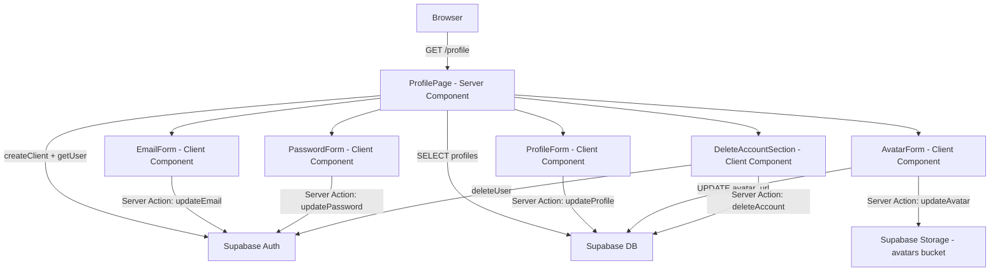

# Design Document: Owner Profile

## Overview

Fitur Owner Profile memungkinkan pemilik toko di MyMenu SaaS untuk mengelola data akun mereka sendiri melalui halaman `/profile` di dalam dashboard. Fitur ini mencakup:

- Melihat dan mengedit nama tampilan (display name)
- Upload dan ganti foto profil (avatar) via Supabase Storage
- Ganti email (dengan konfirmasi via Supabase Auth)
- Ganti password
- Hapus akun (danger zone)

Semua mutasi diimplementasikan sebagai Next.js Server Actions mengikuti pola yang sudah ada di `src/lib/actions/store.ts` dan `src/lib/actions/menu.ts`. Halaman profil adalah Server Component yang mengambil data profil terkini dari Supabase, lalu merender form client-side untuk setiap seksi.

---

## Architecture



Arsitektur mengikuti pola Next.js 14 App Router:
- **Server Component** (`page.tsx`) — fetch data, tidak ada state
- **Client Components** — form interaktif dengan `useActionState` / `useTransition`
- **Server Actions** (`profile.ts`) — semua mutasi, validasi, dan revalidasi cache

---

## Components and Interfaces

### Server Action: `src/lib/actions/profile.ts`

```typescript
// Input types
export interface UpdateProfileInput {
  displayName: string
}

export interface UpdateAvatarInput {
  file: File
}

export interface UpdateEmailInput {
  newEmail: string
}

export interface UpdatePasswordInput {
  newPassword: string
  confirmPassword: string
}

export interface DeleteAccountInput {
  confirmEmail: string
}

// Return type (konsisten dengan pola yang ada)
type ActionResult = { error: string | null }

export async function updateProfile(input: UpdateProfileInput): Promise<ActionResult>
export async function updateAvatar(formData: FormData): Promise<ActionResult>
export async function updateEmail(input: UpdateEmailInput): Promise<ActionResult>
export async function updatePassword(input: UpdatePasswordInput): Promise<ActionResult>
export async function deleteAccount(input: DeleteAccountInput): Promise<ActionResult>
```

### Page: `src/app/(dashboard)/profile/page.tsx`

Server Component yang:
1. Memanggil `createClient()` dan `supabase.auth.getUser()`
2. Mengambil row `profiles` untuk user yang login
3. Merender layout dengan semua sub-form sebagai Client Components

### Client Components

| Komponen | File | Tanggung Jawab |
|---|---|---|
| `ProfileForm` | `src/components/profile-form.tsx` | Form edit display_name |
| `AvatarForm` | `src/components/avatar-form.tsx` | Upload/preview avatar |
| `EmailForm` | `src/components/email-form.tsx` | Form ganti email |
| `PasswordForm` | `src/components/password-form.tsx` | Form ganti password |
| `DeleteAccountSection` | `src/components/delete-account-section.tsx` | Danger zone + dialog konfirmasi |

### Dashboard Layout Update

`src/app/(dashboard)/layout.tsx` perlu diupdate untuk:
- Menampilkan `display_name` (jika ada) sebagai prioritas utama, fallback ke username dari email
- Menampilkan `avatar_url` sebagai `<Image>` jika ada, fallback ke inisial
- Menambahkan link "Profil" ke nav items

---

## Data Models

### Database Migration

File baru: `supabase/migrations/008_profile_columns.sql`

```sql
-- Tambah kolom display_name dan avatar_url ke tabel profiles
ALTER TABLE profiles
  ADD COLUMN IF NOT EXISTS display_name VARCHAR(50),
  ADD COLUMN IF NOT EXISTS avatar_url TEXT;
```

### TypeScript Types Update

`src/types/database.types.ts` — tabel `profiles` perlu diupdate:

```typescript
profiles: {
  Row: {
    id: string
    email: string
    role: string
    status: string
    created_at: string
    display_name: string | null   // NEW
    avatar_url: string | null     // NEW
  }
  Insert: {
    // ... existing fields
    display_name?: string | null  // NEW
    avatar_url?: string | null    // NEW
  }
  Update: {
    // ... existing fields
    display_name?: string | null  // NEW
    avatar_url?: string | null    // NEW
  }
}
```

### Supabase Storage

- Bucket: `avatars` (public bucket)
- Path convention: `{user_id}/avatar.{ext}` (misal: `abc123/avatar.jpg`)
- File lama dihapus sebelum upload file baru menggunakan `storage.remove()`
- URL publik diambil via `storage.getPublicUrl()`

### Validation Rules

| Field | Rule |
|---|---|
| `display_name` | Required, 2–50 karakter |
| Avatar file type | `image/jpeg`, `image/png`, `image/webp` |
| Avatar file size | Maks 2 MB (2 × 1024 × 1024 bytes) |
| Email | Format valid (regex atau `z.string().email()`) |
| Password | Min 8 karakter |
| Confirm password | Harus identik dengan password baru |

---


## Correctness Properties

*A property is a characteristic or behavior that should hold true across all valid executions of a system — essentially, a formal statement about what the system should do. Properties serve as the bridge between human-readable specifications and machine-verifiable correctness guarantees.*

### Property 1: Display name fallback ke username email

*For any* user yang tidak memiliki `display_name` tersimpan, fungsi yang menghasilkan nama tampilan harus mengembalikan bagian username (sebelum `@`) dari email user tersebut.

**Validates: Requirements 1.2**

---

### Property 2: Avatar placeholder menggunakan inisial

*For any* user yang tidak memiliki `avatar_url`, fungsi yang menghasilkan placeholder avatar harus mengembalikan huruf pertama dari display name (atau fallback username email) dalam bentuk uppercase.

**Validates: Requirements 1.3**

---

### Property 3: Validasi panjang display name

*For any* string yang panjangnya kurang dari 2 karakter atau lebih dari 50 karakter, `updateProfile` harus mengembalikan `{ error: non-null }` dan tidak melakukan update ke database.

**Validates: Requirements 2.2, 2.3**

---

### Property 4: Penyimpanan display name

*For any* string display name yang valid (panjang 2–50 karakter), setelah `updateProfile` berhasil dipanggil, query ke tabel `profiles` untuk user tersebut harus mengembalikan nilai `display_name` yang sama persis dengan yang dikirimkan.

**Validates: Requirements 2.1**

---

### Property 5: Validasi file avatar (tipe dan ukuran)

*For any* file yang bertipe MIME selain `image/jpeg`, `image/png`, `image/webp`, atau berukuran lebih dari 2 MB, `updateAvatar` harus mengembalikan `{ error: non-null }` tanpa melakukan upload ke storage.

**Validates: Requirements 3.2, 3.3, 3.4**

---

### Property 6: Path storage avatar mengikuti konvensi

*For any* user yang mengupload avatar valid, file harus disimpan di Supabase Storage pada path `{user_id}/avatar.{ext}` di mana `ext` sesuai dengan tipe MIME file yang diupload.

**Validates: Requirements 3.1**

---

### Property 7: Avatar URL tersimpan setelah upload berhasil

*For any* upload avatar yang berhasil, nilai `avatar_url` di tabel `profiles` untuk user tersebut harus berisi URL publik yang valid dan dapat diakses (non-null, non-empty string).

**Validates: Requirements 3.5**

---

### Property 8: Satu avatar per user di storage

*For any* user yang melakukan upload avatar lebih dari satu kali, setelah setiap upload berhasil, hanya ada satu file avatar untuk user tersebut di storage (file lama dihapus).

**Validates: Requirements 3.6**

---

### Property 9: Validasi format email

*For any* string yang bukan format email valid (tidak mengandung `@` dengan domain yang valid), `updateEmail` harus mengembalikan `{ error: non-null }` tanpa memanggil Supabase Auth.

**Validates: Requirements 4.2, 4.3**

---

### Property 10: Error propagation dari Auth Service

*For any* kondisi di mana Supabase Auth mengembalikan error (baik saat `updateUser` untuk email maupun password), Server Action yang bersangkutan harus mengembalikan `{ error: non-null }` dengan pesan yang informatif.

**Validates: Requirements 4.6, 5.6**

---

### Property 11: Validasi password (kecocokan dan panjang)

*For any* pasangan `(newPassword, confirmPassword)` di mana keduanya tidak identik, atau di mana `newPassword` memiliki panjang kurang dari 8 karakter, `updatePassword` harus mengembalikan `{ error: non-null }` tanpa memanggil Supabase Auth.

**Validates: Requirements 5.1, 5.2, 5.3, 5.4**

---

### Property 12: Ganti password tidak logout sesi aktif

*For any* user yang berhasil mengganti password, sesi aktif user tersebut harus tetap valid setelah `updatePassword` selesai (tidak ada pemanggilan `signOut`).

**Validates: Requirements 5.7**

---

### Property 13: Konfirmasi email untuk hapus akun

*For any* input `confirmEmail` yang tidak cocok dengan email akun user yang sedang login, `deleteAccount` harus mengembalikan `{ error: non-null }` tanpa menghapus data dari tabel `profiles` maupun `auth.users`.

**Validates: Requirements 6.5**

---

### Property 14: Urutan operasi hapus akun

*For any* user yang mengkonfirmasi penghapusan dengan email yang benar, `deleteAccount` harus menghapus row dari tabel `profiles` terlebih dahulu, kemudian memanggil Auth Service untuk menghapus dari `auth.users` (bukan sebaliknya).

**Validates: Requirements 6.3, 6.4**

---

## Error Handling

Semua Server Actions mengembalikan `{ error: string | null }` — pola yang konsisten dengan `store.ts` dan `menu.ts` yang sudah ada.

| Skenario Error | Pesan (Bahasa Indonesia) |
|---|---|
| Tidak terautentikasi | `'Tidak terautentikasi.'` |
| Display name terlalu pendek | `'Nama tampilan minimal 2 karakter.'` |
| Display name terlalu panjang | `'Nama tampilan maksimal 50 karakter.'` |
| Tipe file avatar tidak valid | `'File harus berupa gambar JPEG, PNG, atau WebP.'` |
| Ukuran file avatar terlalu besar | `'Ukuran file maksimal 2 MB.'` |
| Format email tidak valid | `'Format email tidak valid.'` |
| Password terlalu pendek | `'Password minimal 8 karakter.'` |
| Password tidak cocok | `'Konfirmasi password tidak sesuai.'` |
| Email konfirmasi hapus akun salah | `'Email tidak sesuai. Penghapusan dibatalkan.'` |
| Error dari Supabase Auth/DB | Teruskan `error.message` dari Supabase |

Untuk error yang tidak terduga dari Supabase, action mengembalikan pesan generik: `'Terjadi kesalahan. Silakan coba lagi.'`

---

## Testing Strategy

### Pendekatan Dual Testing

Fitur ini menggunakan dua lapisan pengujian yang saling melengkapi:

1. **Unit tests** — untuk contoh spesifik, edge case, dan integrasi antar komponen
2. **Property-based tests** — untuk memverifikasi properti universal di berbagai input acak

### Unit Tests

Fokus pada:
- Contoh konkret: user dengan display_name valid berhasil diupdate
- Integrasi: halaman profil merender semua field yang diperlukan (Requirements 1.1)
- UI behavior: tombol "Hapus Akun" muncul di danger zone (Requirements 6.1, 6.2)
- Error conditions: Supabase mengembalikan error diteruskan dengan benar

### Property-Based Tests

Library yang digunakan: **[fast-check](https://github.com/dubzzz/fast-check)** (TypeScript/JavaScript)

Konfigurasi: minimum **100 iterasi** per property test.

Setiap property test harus diberi tag komentar dengan format:
```
// Feature: owner-profile, Property {N}: {property_text}
```

Mapping property ke test:

| Property | Test | Arbitraries |
|---|---|---|
| P1: Display name fallback | `fc.emailAddress()` → verifikasi username sebelum `@` | `fc.emailAddress()` |
| P2: Avatar placeholder inisial | `fc.string()` sebagai display_name → verifikasi `charAt(0).toUpperCase()` | `fc.string({ minLength: 1 })` |
| P3: Validasi panjang display name | String < 2 atau > 50 karakter → error | `fc.string({ maxLength: 1 })`, `fc.string({ minLength: 51 })` |
| P4: Penyimpanan display name | String valid 2–50 karakter → tersimpan di DB | `fc.string({ minLength: 2, maxLength: 50 })` |
| P5: Validasi file avatar | File dengan MIME/ukuran invalid → error | Custom arbitrary untuk File mock |
| P6: Path storage avatar | Upload valid → path `{uid}/avatar.{ext}` | `fc.uuid()`, `fc.constantFrom('jpg','png','webp')` |
| P7: Avatar URL tersimpan | Upload berhasil → `avatar_url` non-null | Mock Supabase Storage |
| P8: Satu avatar per user | Upload dua kali → hanya satu file di storage | Mock Supabase Storage |
| P9: Validasi format email | String bukan email → error, Auth tidak dipanggil | `fc.string()` yang bukan email |
| P10: Error propagation Auth | Auth error → action error non-null | Mock Supabase Auth error |
| P11: Validasi password | Password tidak cocok atau < 8 char → error | `fc.string()`, `fc.string({ maxLength: 7 })` |
| P12: Tidak logout setelah ganti password | Password valid → `signOut` tidak dipanggil | `fc.string({ minLength: 8 })` |
| P13: Konfirmasi email hapus akun | Email salah → error, data tidak terhapus | `fc.emailAddress()` berbeda dari email user |
| P14: Urutan operasi hapus akun | Email benar → profiles dihapus sebelum auth.users | Mock dengan spy pada urutan pemanggilan |

### Struktur File Test

```
src/lib/actions/__tests__/
  profile.test.ts        # Unit tests untuk semua Server Actions
  profile.property.ts    # Property-based tests dengan fast-check
src/components/__tests__/
  profile-form.test.tsx  # Unit tests komponen form
  delete-account-section.test.tsx
```
