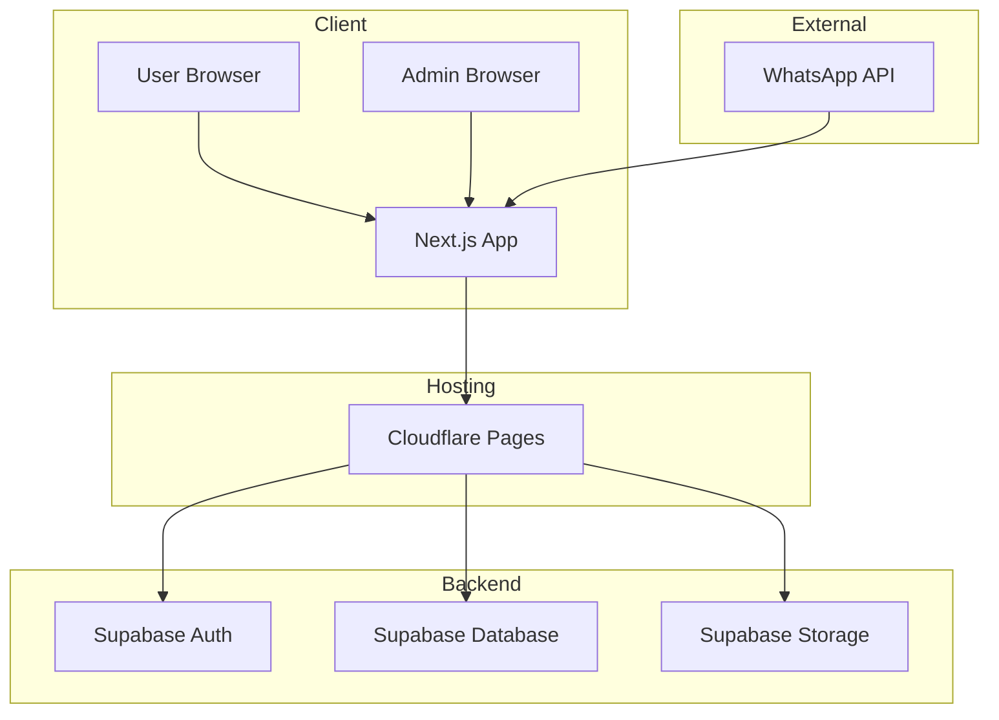
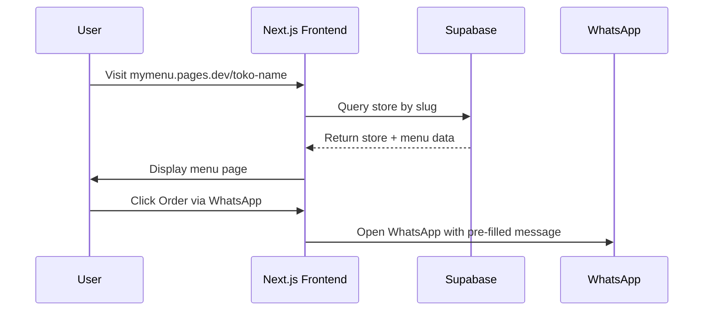
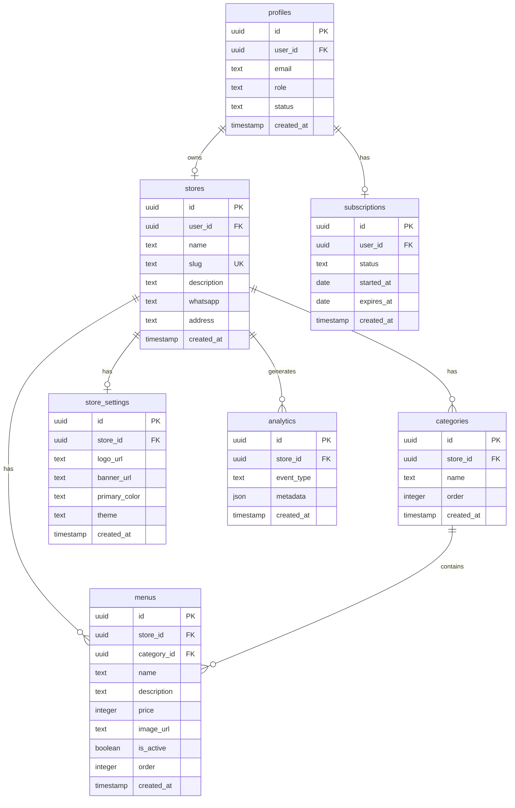
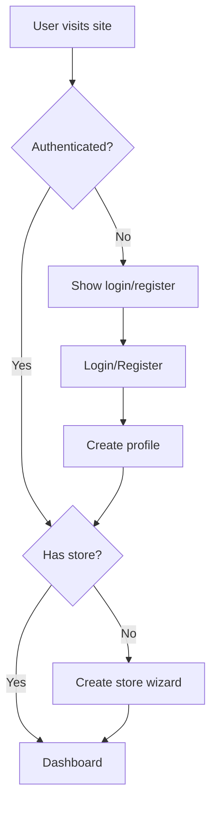
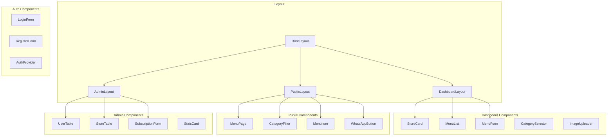
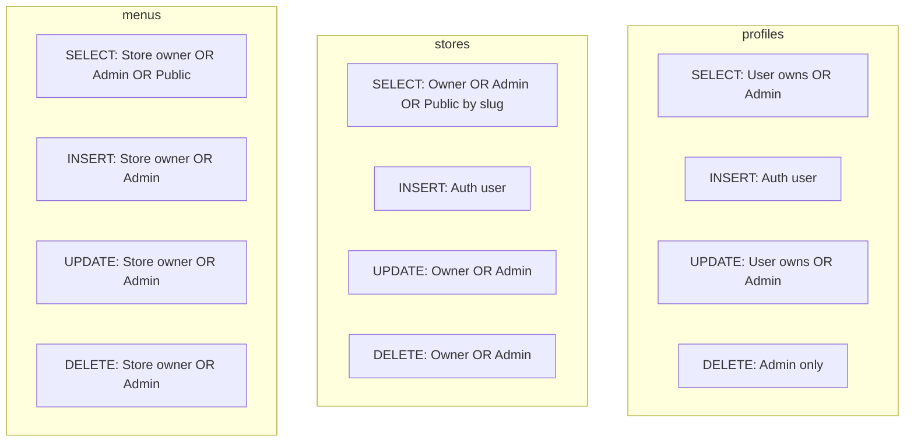
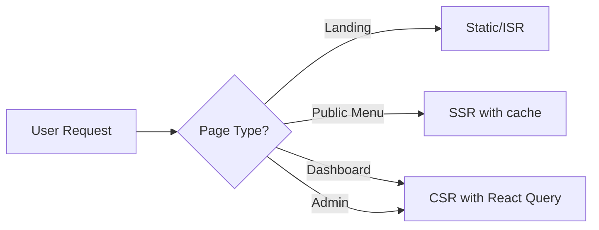
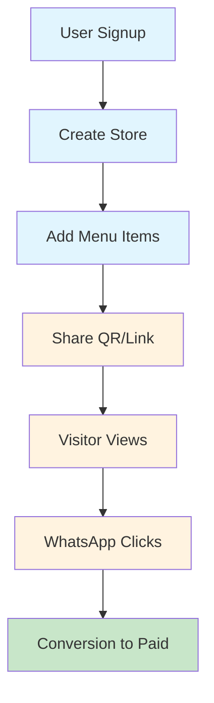

# My Menu - Technical Architecture Plan

## 1. System Overview



## 2. Application Flow



## 3. Database Schema



## 4. Authentication Flow



## 5. Route Structure

```
app/
├── (public)/
│   ├── page.tsx              # Landing page
│   └── [slug]/
│       └── page.tsx          # Public menu page
│
├── (auth)/
│   ├── login/
│   │   └── page.tsx
│   └── register/
│       └── page.tsx
│
├── (dashboard)/
│   ├── dashboard/
│   │   └── page.tsx          # User dashboard home
│   ├── store/
│   │   ├── new/
│   │   │   └── page.tsx      # Create store
│   │   └── [id]/
│   │       └── page.tsx      # Edit store
│   ├── menu/
│   │   ├── page.tsx          # Menu list
│   │   ├── new/
│   │   │   └── page.tsx      # Create menu
│   │   └── [id]/
│   │       └── page.tsx      # Edit menu
│   └── settings/
│       └── page.tsx          # Account settings
│
├── (admin)/
│   ├── admin/
│   │   ├── dashboard/
│   │   │   └── page.tsx      # Admin dashboard
│   │   ├── users/
│   │   │   ├── page.tsx      # User list
│   │   │   └── [id]/
│   │   │       └── page.tsx  # User detail
│   │   ├── stores/
│   │   │   └── page.tsx      # Store list
│   │   └── subscriptions/
│   │       └── page.tsx      # Subscription mgmt
│   └── layout.tsx            # Admin layout with guard
│
└── api/
    ├── upload/
    │   └── route.ts          # Image upload endpoint
    └── webhook/
        └── payment/
            └── route.ts      # Payment webhook (future)
```

## 6. Component Architecture



## 7. Security Model

### Row Level Security (RLS) Policies



## 8. API Integration Points

### Supabase Client Setup
- Browser client for client components
- Server client for server components and API routes
- Middleware client for auth guards

### Storage Configuration
- Bucket: `store-images` for logos/banners
- Bucket: `menu-images` for menu item photos
- Public access for read, authenticated for write

## 9. Performance Optimization Strategy

### Database
- Index on `stores.slug` for fast lookup
- Index on `menus.store_id` for menu queries
- Index on `menus.category_id` for filtering
- Index on `menus.is_active` for active items

### Frontend
- Server-side rendering for public pages
- Static generation for landing page
- Client-side caching with React Query
- Image optimization with Next.js Image

### Caching Strategy


## 10. Environment Variables

```env
# Supabase
NEXT_PUBLIC_SUPABASE_URL=
NEXT_PUBLIC_SUPABASE_ANON_KEY=
SUPABASE_SERVICE_ROLE_KEY=

# App
NEXT_PUBLIC_APP_URL=https://mymenu.pages.dev

# Optional (future features)
STRIPE_SECRET_KEY=
STRIPE_WEBHOOK_SECRET=
```

## 11. Technology Stack Summary

| Layer | Technology | Purpose |
|-------|-----------|---------|
| Framework | Next.js 14 | Full-stack React |
| Language | TypeScript | Type safety |
| Styling | Tailwind CSS | Utility-first CSS |
| UI Components | shadcn/ui | Accessible components |
| Auth | Supabase Auth | Email/password auth |
| Database | Supabase (PostgreSQL) | Data storage |
| Storage | Supabase Storage | Image hosting |
| Hosting | Cloudflare Pages | Edge deployment |
| Forms | React Hook Form + Zod | Form handling & validation |
| State | React Query | Server state management |

## 12. Development Phases

### Phase 1: MVP (Weeks 1-2)
- Project setup
- Database schema
- Authentication
- Store CRUD
- Menu CRUD
- Public menu page

### Phase 2: Enhanced UX (Week 3)
- Dashboard improvements
- Image upload
- Category management
- WhatsApp integration

### Phase 3: Admin Panel (Week 4)
- Admin dashboard
- User management
- Subscription management
- Store monitoring

### Phase 4: Premium Features (Future)
- Custom branding
- Theme system
- QR Code generator
- Analytics
- Payment gateway

## 13. Success Metrics Tracking



## 14. Risk Mitigation

| Risk | Impact | Mitigation |
|------|--------|------------|
| Slug collision | High | Database unique constraint + real-time validation |
| Image abuse | Medium | File size limits, type validation, moderation |
| Performance | Medium | Indexing, caching, CDN |
| Security | High | RLS policies, input validation, sanitization |
| Payment (future) | High | Use established gateway (Midtrans/Xendit) |
